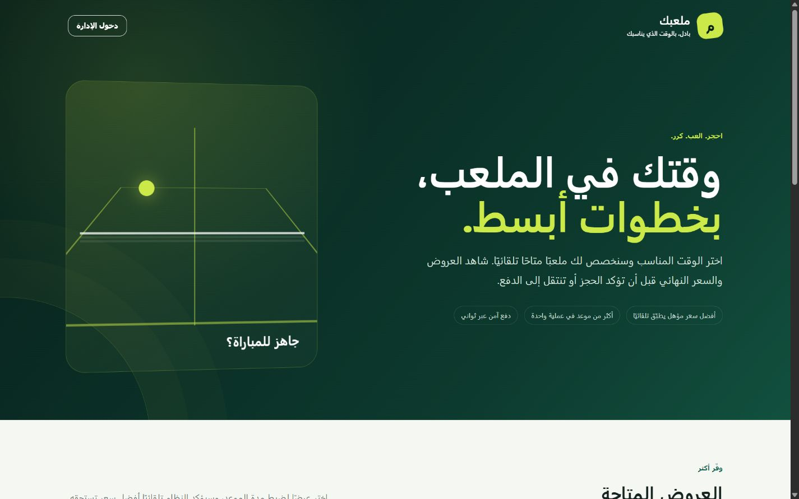
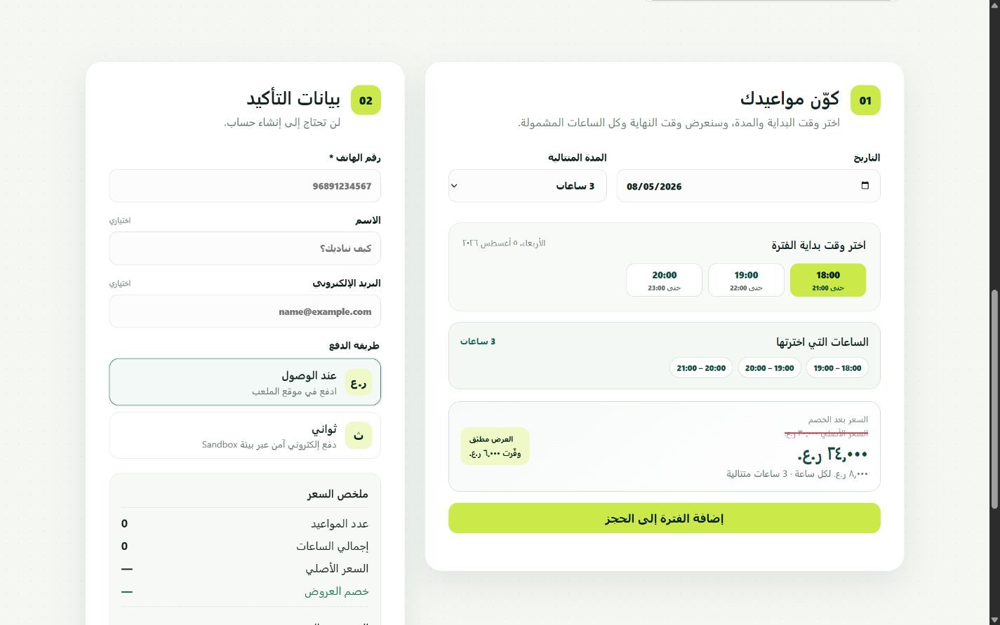
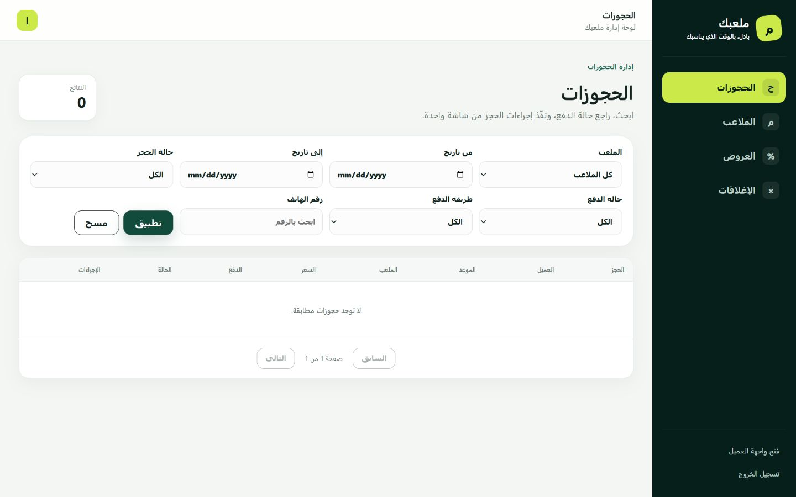

# PadelBooking

منصة عربية متجاوبة لحجز ملاعب البادل، تتكون من واجهة عميل ولوحة إدارة داخل تطبيق React واحد، مع Backend مبني على ASP.NET Core 8 وEntity Framework Core وSQLite.

[](https://github.com/alshimaalshibli-max/PadelBooking/actions/workflows/ci.yml)

## التجربة المباشرة

- الموقع: [PadelBooking Live Demo](https://web-production-69d1f8.up.railway.app/)
- لوحة الإدارة: [Admin Login](https://web-production-69d1f8.up.railway.app/admin/login)
- Swagger: [API Documentation](https://web-production-69d1f8.up.railway.app/swagger)
- Health Check: [Service Health](https://web-production-69d1f8.up.railway.app/health)

بيانات دخول الإدارة المخصصة لنسخة التقييم:

- اسم المستخدم: `admin`
- كلمة المرور: `PadelDemo-2026!`

هذه بيانات Demo عامة ومؤقتة لتمكين المقيّم من تجربة لوحة الإدارة. قاعدة بيانات العرض منفصلة عن قاعدة التطوير المحلية، وتحتوي على بيانات تجريبية فقط. لا تُستخدم هذه البيانات أو كلمة المرور في أي بيئة إنتاج.

### مسار تقييم سريع

1. افتح واجهة العميل، واختر عرض 3 ساعات لمشاهدة السعر الأصلي والسعر بعد الخصم والمبلغ الموفّر.
2. اختر وقتًا متاحًا، وأضف الفترة إلى الحجز، ثم جرّب الدفع عند الوصول أو Thawani UAT.
3. لاختبار الدفع المقبول استخدم البطاقة الرسمية `4242 4242 4242 4242`، وتاريخ انتهاء مستقبلي، وأي CVV، ثم OTP بقيمة `1234`.
4. افتح لوحة الإدارة بالبيانات أعلاه لتجربة الملاعب والحجوزات والعروض والإغلاقات والفلاتر وPagination.
5. استخدم Swagger لمراجعة المسارات العامة والمسارات الإدارية المحمية بـJWT.

بطاقات UAT لا تخصم أي مبلغ حقيقي. تفاصيل البطاقة مأخوذة من [توثيق بطاقات Thawani الرسمي](https://thawani-technologies.stoplight.io/docs/thawani-ecommerce-api/7c0f75e1668d7-thawani-test-card).

## صور المشروع

### واجهة العميل



### اختيار الساعات وعرض السعر



### لوحة الإدارة



## الوظائف الرئيسية

- عرض الأوقات المتاحة دون كشف أسماء الملاعب للعميل.
- تخصيص ملعب متاح عشوائيًا ومنع تعارض الحجوزات، مع تثبيت السعر عبر عرض سعر مشفّر قصير الصلاحية.
- حجز ساعة أو عدة ساعات وعدة مواعيد أو أيام ضمن عملية ذرية واحدة.
- الدفع عند الوصول أو إنشاء جلسة دفع عبر Thawani Sandbox.
- إدارة الملاعب والأسعار وساعات العمل.
- إدارة العروض حسب عدد الساعات.
- إغلاقات عامة أو لعدة ملاعب عبر نطاق تواريخ وأيام أسبوع محددة.
- قسم إحصائيات إداري للمؤشرات والرسوم، وفلترة الحجوزات مع Pagination وتحديث حالات الحجز والدفع.
- حماية لوحة الإدارة باستخدام JWT.

## التقنيات

- .NET 8 / ASP.NET Core Web API
- Entity Framework Core 8
- SQLite
- xUnit وWebApplicationFactory لاختبارات التكامل
- React 19
- Vite 8
- CSS متجاوب وRTL دون مكتبات تصميم خارجية

## المتطلبات

- .NET SDK 8
- Node.js حديث متوافق مع Vite 8
- npm

## إعداد Backend

أسرار الإدارة وThawani غير محفوظة في كود التطبيق. اضبطها في جلسة PowerShell قبل التشغيل.

### بيانات دخول Demo للتقييم المحلي

- اسم المستخدم: `admin`
- كلمة المرور: `PadelDemo-2026!`

هذه بيانات نسخة التقييم فقط، وليست إعدادات افتراضية داخل التطبيق. استبدلها بقيم خاصة وقوية عند أي نشر حقيقي.

```powershell
$env:AdminAuth__Username="admin"
$env:AdminAuth__Password="PadelDemo-2026!"
$env:AdminAuth__JwtKey="Local-Demo-Jwt-Key-Change-For-Any-Deployment-2026"
$env:BookingQuotes__EncryptionKey="Local-Demo-Quote-Key-Change-For-Any-Deployment-2026"

# Required only for electronic payment testing.
$env:Thawani__SecretKey="<sandbox-secret-key>"
$env:Thawani__PublishableKey="<sandbox-publishable-key>"

dotnet run --project backend\PadelBooking.API\PadelBooking.API.csproj
```

يعمل API افتراضيًا على `http://localhost:5018` حسب ملف التشغيل، وتوجد Swagger في `/swagger` عند استخدام بيئة Development.

عند غياب إعدادات الإدارة تظل مسارات العميل العامة تعمل، بينما ترفض لوحة الإدارة تسجيل الدخول بأمان.

## إعداد Frontend

```powershell
Set-Location frontend
Copy-Item .env.example .env.local
npm install
npm run dev
```

المتغير الوحيد الذي يصل إلى كود المتصفح هو:

```text
VITE_API_BASE_URL=http://localhost:5018/api
```

لا تضع كلمة مرور الإدارة أو مفاتيح Thawani في أي متغير يبدأ بـ`VITE_`، لأن هذه المتغيرات تصبح مرئية داخل حزمة المتصفح.

## بناء المشروع

```powershell
dotnet build backend\PadelBooking.API\PadelBooking.API.csproj
dotnet build backend\PadelBooking.API.Tests\PadelBooking.API.Tests.csproj

Set-Location frontend
npm install
npm run build
```

## CI والنشر

يشغّل GitHub Actions تلقائيًا عند كل Push أو Pull Request:

- استعادة حزم Backend وبناؤه بوضع Release.
- تشغيل جميع اختبارات xUnit.
- تثبيت حزم Frontend باستخدام `npm ci` وبناء Vite.
- بناء صورة Docker كاملة دون نشرها.

يحتوي المستودع على `Dockerfile` متعدد المراحل و`railway.json`. عند النشر يجب ربط Volume دائم بالمسار `/data` وضبط القيم التالية كمتغيرات بيئة في منصة الاستضافة، لا داخل GitHub:

- `ConnectionStrings__DefaultConnection`
- `AdminAuth__Username`
- `AdminAuth__Password`
- `AdminAuth__JwtKey`
- `BookingQuotes__EncryptionKey`
- `Thawani__SecretKey`
- `Thawani__PublishableKey`
- `Thawani__SuccessUrl`
- `Thawani__CancelUrl`

يخدم Backend حزمة React من `wwwroot` في صورة الإنتاج، ويعرض `/health` فحصًا فعليًا لاتصال SQLite. نسخة Railway الحالية تستخدم قاعدة جديدة داخل `/data/padelbooking.db` ولا ترفع ملف `padelbooking.db` المحلي.

## تشغيل الاختبارات

```powershell
dotnet test backend\PadelBooking.API.Tests\PadelBooking.API.Tests.csproj
```

الحالة الحالية: `24/24` اختبارًا ناجحًا.

تستخدم الاختبارات SQLite داخل الذاكرة من خلال `Data Source=:memory:`. لا تتصل الاختبارات بملف `padelbooking.db` ولا تعدّل بياناته.

تشمل الاختبارات:

- تسجيل دخول الإدارة ورفض البيانات الخاطئة.
- حماية المسارات الإدارية.
- الحجز الصحيح والتعارض والعروض.
- التوزيع العشوائي وثبات السعر النهائي باستخدام عرض السعر المشفّر.
- الأوقات الماضية والإغلاقات.
- ذرية الحجز الجماعي.
- الإغلاقات الجماعية ونطاق التواريخ.
- الإلغاء والدفع والإكمال.
- الفلاتر وPagination.
- صيغة إنشاء جلسة Thawani والتحقق من المبلغ والعملة والمرجع.
- عدم كشف مفاتيح Thawani ورفض الحجز الإلكتروني قبل الحفظ عند غياب إعدادات Sandbox.
- إلغاء الحجز غير المدفوع عند تعذر إنشاء جلسة Thawani.

## إعداد Thawani Sandbox

يستخدم Backend القيم التالية، ويمكن ضبطها عبر متغيرات البيئة ذات الصيغة نفسها باستخدام فاصل `__`:

- `Thawani:SecretKey`
- `Thawani:PublishableKey`
- `Thawani:ApiBaseUrl`
- `Thawani:CheckoutBaseUrl`
- `Thawani:SuccessUrl`
- `Thawani:CancelUrl`

يجب أن تشير روابط النجاح والإلغاء إلى:

- `/payment/success`
- `/payment/cancel`

يحوّل Backend الريال العُماني إلى البيسة (`1 OMR = 1000`) ويتحقق من أن مبلغ الجلسة وعملتها ومرجعها تطابق الحجوزات قبل تحديث حالة الدفع. إذا تعذر إنشاء جلسة الدفع، تُلغى الحجوزات غير المدفوعة حتى لا تبقى المواعيد محجوزة دون دفع.

عندما لا تكون مفاتيح Sandbox مضبوطة، يعرض `GET /api/payments/configuration` حالة التوفر فقط دون أي قيم حساسة. تبقي واجهة العميل خيار ثواني ظاهرًا لكنه معطّل مع توضيح سبب عدم توفره، ويرفض Backend أي حجز إلكتروني مباشر قبل حفظه. يتفعّل الخيار تلقائيًا بعد ضبط المفتاحين وإعادة تشغيل Backend.

### تجربة دفع UAT

1. انسخ مفتاحي UAT المنشورين في [توثيق التكامل الرسمي](https://thawani-technologies.stoplight.io/docs/thawani-ecommerce-api/5534c91789a48-thawani-e-commerce-api) إلى متغيري البيئة الموضحين أعلاه، ولا تحفظهما في المستودع.
2. شغّل Backend ثم Frontend، وأنشئ حجزًا بطريقة الدفع `Thawani`.
3. استخدم بطاقة القبول العامة الموجودة في [صفحة بطاقات الاختبار الرسمية](https://thawani-technologies.stoplight.io/docs/thawani-ecommerce-api/7c0f75e1668d7-thawani-test-card): الرقم `4242 4242 4242 4242`، أي تاريخ انتهاء مستقبلي، أي CVV، ثم OTP بقيمة `1234`.
4. بعد العودة إلى `/payment/success` تتحقق الواجهة من الجلسة عبر Backend، ولا تتحول حالة الحجز إلى `Paid` إلا بعد أن تؤكد Thawani نجاح الدفع وتطابق المرجع والمبلغ والعملة.

بطاقات UAT لا تخصم مبلغًا حقيقيًا. استخدم مفاتيح التاجر الخاصة بالجهة وبوابة الإنتاج فقط عند النشر الفعلي.

## ملاحظات الأمان

- لا توجد بيانات دخول أو مفاتيح دفع حقيقية داخل الكود.
- قيم Demo الواردة في README مخصصة للتقييم المحلي ويجب استبدالها في أي نشر فعلي.
- رمز الإدارة يُحفظ في `sessionStorage` ويُزال عند تسجيل الخروج.
- مسارات الإدارة فقط تتطلب دور `Admin`.
- إنشاء الحجز وعرض الأوقات والدفع متاحة للعميل دون حساب.
- يتحقق Backend من جلسة Thawani قبل تحديث حالة الدفع إلى `Paid`.
